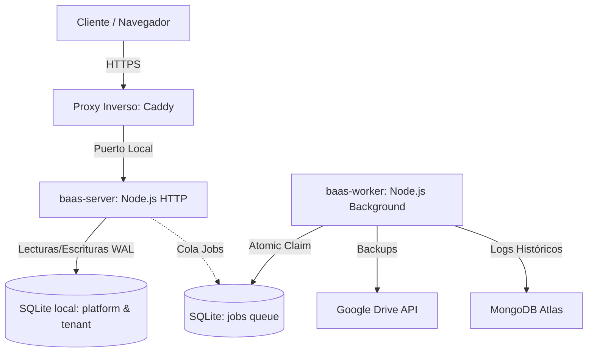

# BaaS Multi-Tenant Platform

Este proyecto es una plataforma **Backend-as-a-Service (BaaS) Multi-Tenant** diseñada bajo estándares profesionales de producción (segun la IA xd). Su objetivo es permitir la creación y aprovisionamiento dinámico de múltiples backends aislados (inquilinos/tenants) bajo un único servidor físico optimizado para entornos VPS con recursos limitados.

---

## 🚀 Arquitectura de Código

Para evitar el acoplamiento y asegurar la mantenibilidad a gran escala, el backend sigue tres principios fundamentales:

1. **Feature-Based (Modularización por Negocio):** En lugar de agrupar el código por su tecnología (controladores por un lado, modelos por otro), el directorio [src/backend/feature](file:///c:/Users/USER/Desktop/test-back/8vo_intento_de_desarrollo/src/backend/feature) agrupa el código por funcionalidad del negocio (ej. autenticación, panel de control, gestión de inquilinos). Cada módulo es autocontenido y define sus propias vistas, controladores, casos de uso y pruebas.
2. **DDD Lite (Domain-Driven Design Simplificado):**
   * **Dominio:** Las entidades de negocio son objetos JavaScript puros e independientes de librerías u ORMs.
   * **Contratos:** Interfaces que desacoplan la lógica de negocio de los proveedores externos (ej. envío de correos, conexión de bases de datos).
   * **Casos de Uso (Use Cases):** Orquestadores puros que ejecutan las reglas del negocio llamando a los contratos a través de **Inyección de Dependencias (DI)** mediante [Awilix](https://github.com/jeffijoe/awilix).
3. **TDD (Test-Driven Development):** El desarrollo de los flujos de negocio está guiado por pruebas unitarias e de integración usando [Vitest](https://vitest.dev/), garantizando calidad sin regresiones.

---

## 🏛️ Topología de Datos y Concurrencia

La plataforma implementa un modelo **híbrido y aislado** para gestionar la información de los diferentes inquilinos de forma eficiente y segura:

### 1. Aislamiento de Base de Datos (Multi-Tenant)
* **Plataforma Central:** Controlada mediante una base de datos local SQLite (`platform.db`) administrada por el Superadmin para registrar inquilinos, suscripciones, configuraciones generales y la cola de trabajos.
* **Inquilinos (Tenants):** Cada inquilino cuenta con su propio archivo SQLite físico (`<tenantId>.db`) para sus usuarios, roles y credenciales locales. Esto asegura un aislamiento completo de los datos (*data isolation*).
* **Escalabilidad Cloud:** Para almacenamiento masivo de negocio o datos dinámicos, el inquilino puede conectarse automáticamente a bases de datos relacionales en la nube (PostgreSQL vía [Neon.tech](https://neon.tech/)) o documentales (MongoDB Atlas).

### 2. Concurrencia en SQLite en Producción
Para evitar que múltiples escrituras bloqueen la base de datos y generen errores `SQLITE_BUSY`, toda conexión en [app.js](file:///c:/Users/USER/Desktop/test-back/8vo_intento_de_desarrollo/src/backend/kernel/app.js) se inicializa con los siguientes parámetros optimizados:
```sql
PRAGMA journal_mode = WAL;      -- Habilita Write-Ahead Logging para lectura/escritura concurrentes.
PRAGMA busy_timeout = 5000;     -- Reintenta automáticamente escrituras bloqueadas por hasta 5 segundos.
PRAGMA synchronous = NORMAL;    -- Optimiza la velocidad de sincronización de disco con seguridad transaccional.
PRAGMA foreign_keys = ON;       -- Garantiza la integridad referencial.
```

---

## 🛠️ Stack Tecnológico

La aplicación está construida sobre tecnologías modernas de alto rendimiento:

* **Servidor HTTP:** [Fastify](https://fastify.dev/) (alternativa moderna y hasta 5 veces más rápida que Express.js).
* **ORM:** [Drizzle ORM](https://orm.drizzle.team/) para definir esquemas estructurados de base de datos y realizar migraciones tipo *type-safe*.
* **Inyección de Dependencias:** [Awilix](https://github.com/jeffijoe/awilix) para gestionar el ciclo de vida de los servicios de forma desacoplada.
* **Caché y Limitador:** [Valkey](https://valkey.io/) (fork de código abierto de Redis) para almacenamiento de sesiones y rate-limiting en memoria.
* **Validación de Datos:** [Zod](https://zod.dev/) para validar esquemas de entrada de peticiones en la capa de presentación.
* **Logs Estructurados:** [Pino](https://github.com/pinojs/pino) para generación de logs optimizada en formato JSON (listo para indexación).

---

## ☁️ Infraestructura de Producción (VPS Zero-Docker)

> [!IMPORTANT]
> **Principio de Ahorro de Recursos (VPS):** En entornos locales de desarrollo se usa Docker para facilitar el entorno, pero en el VPS de producción **no se ejecuta Docker** para ahorrar consumo de memoria RAM. Todos los servicios de apoyo (Valkey, Caddy) se ejecutan de forma **nativa** a nivel de sistema operativo (`systemd`).

El despliegue de producción se estructura en tres componentes principales gestionados por el archivo de procesos de PM2 [ecosystem.config.js](file:///c:/Users/USER/Desktop/test-back/8vo_intento_de_desarrollo/ecosystem.config.js):



### 1. Servidor de Borde y Enrutamiento Dinámico (Caddy)
* **HTTPS y TLS Wildcard:** El proxy inverso [Caddy](https://caddyserver.com/) gestiona automáticamente la encriptación SSL/TLS para dominios wildcard como `*.juliopariona.com`.
* **Subdominios Dinámicos:** Cuando un cliente accede a `tenant1.juliopariona.com`, Caddy delega la petición al servidor Node.js. El backend analiza el subdominio de la petición y carga dinámicamente el pool de conexiones del SQLite respectivo (`tenant1.db`).
* **API REST de Caddy:** Para configuraciones complejas (como servir interfaces estáticas directamente desde el disco o redirigir dominios externos personalizados), el backend utiliza la API REST administrativa de Caddy (`:2019`) para inyectar configuraciones dinámicamente sin reiniciar el servidor.

### 2. Procesamiento Asíncrono (Worker Service)
Las operaciones pesadas que bloquean el hilo principal (como empaquetar backups de bases de datos o enviar reportes) son gestionadas por un servicio independiente en segundo plano ejecutado a través de [worker.js](file:///c:/Users/USER/Desktop/test-back/8vo_intento_de_desarrollo/worker.js).
* **Cola Transaccional:** Se utiliza una cola en base de datos. Para evitar condiciones de carrera, la obtención y reserva de tareas es **atómica** utilizando sentencias SQL estructuradas (`UPDATE ... RETURNING *`).
* **Resiliencia:** Si una tarea falla, el Worker implementa un mecanismo de reintentos automático basado en **exponencial backoff** y archiva los fallos definitivos para análisis posterior.

### 3. Observabilidad Minimalista (Zero-RAM Overhead)
En producción, no se ejecutan servidores pesados de Prometheus ni tableros de Grafana locales para evitar el consumo de memoria en el VPS.
* **Métricas en Código:** Se utiliza `prom-client` para recolectar métricas del estado del servidor.
* **Server-Sent Events (SSE):** Las métricas en vivo del panel de administración se transmiten en tiempo real directamente desde el servidor mediante tecnología SSE hacia el navegador, consumiendo mínimos recursos.

---

## 💻 Guía de Inicio Rápido (Entorno de Desarrollo)

Para levantar el proyecto de forma local, sigue estos pasos:

### 1. Requisitos Previos
* **Node.js** v20 o superior.
* **pnpm** (gestor de paquetes recomendado).
* **Docker Desktop** (para levantar Valkey y Caddy locales).

### 2. Instalación de Dependencias
Instala los paquetes necesarios en el espacio de trabajo:
```bash
pnpm install
```

### 3. Configuración del Entorno
Copia el archivo de variables de entorno de ejemplo y ajusta los valores necesarios (las credenciales locales por defecto ya están preconfiguradas):
```bash
cp .env.example .env
```

### 4. Levantar Servicios de Soporte (Docker)
Inicia los contenedores locales de Valkey y Caddy:
```bash
docker compose up -d
```

### 5. Generar Esquemas de Base de Datos
Genera las migraciones de Drizzle para la base de datos de plataforma e inquilinos:
```bash
pnpm db:generate:platform
pnpm db:generate:tenant
```

### 6. Ejecutar la Aplicación
* **Servidor de Desarrollo (Watch Mode):**
  ```bash
  pnpm dev
  ```
* **Procesador de Tareas (Worker):**
  ```bash
  pnpm worker
  ```

### 7. Ejecutar Pruebas
Valida que todo funcione correctamente ejecutando la suite de tests automatizados:
```bash
pnpm test
```
